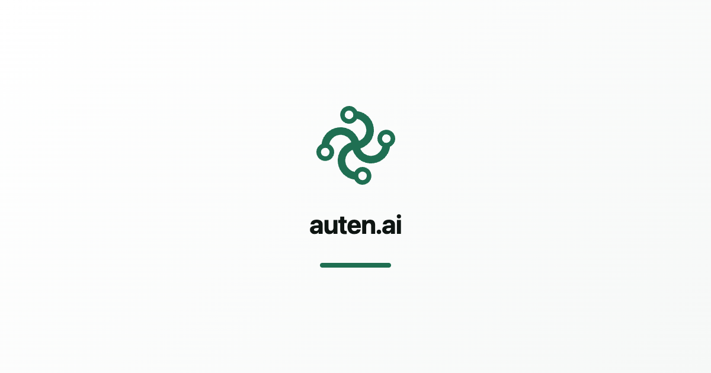

<p align="center">
  <a href="https://auten.ai/mcp"></a>
</p>

<h1 align="center">Auten MCP server</h1>

<p align="center">
  <b>Computer use for the AI agent you already have.</b><br />
  Claude Code, Codex, Cursor, Gemini CLI or any MCP client can click, type and read the screen
  on your Mac, Windows or Linux computer — and your Android phone (beta) — in real apps that have no API.
</p>

<p align="center">
  <a href="https://www.npmjs.com/package/@autenai/mcp"></a>
</p>

<p align="center">
  <a href="https://auten.ai/mcp">Website</a> &nbsp;|&nbsp;
  <a href="https://auten.ai/connect">Setup for every client</a> &nbsp;|&nbsp;
  <a href="https://auten.ai/pricing">Pricing</a> &nbsp;|&nbsp;
  <a href="mailto:hello@auten.ai">hello@auten.ai</a>
</p>

<p align="center">
  <br />
  <sub>Illustration: the first run is driven by your AI, the next runs replay from memory.</sub>
</p>

---

Auten is the hands, your AI is the brain. A small runner on your computer does the clicking,
typing and screen reading. Your agent talks to it over MCP (stdio or SSE). Auten does not ship
its own model and never needs your AI key; your agent keeps using the plan you already pay for.

What makes it different from a plain mouse and keyboard bridge:

- **Reads the UI, not just pixels.** It uses the accessibility tree, so your agent gets a numbered
  list of real buttons and fields (`list_elements` then `click_at(3)`) instead of guessing
  coordinates. OCR and real screenshots are there when an app has no accessibility info.
- **Learns a task once, replays it without AI.** After your agent finishes a task, Auten can save
  it as a skill. The next run replays in seconds, with no tokens spent, and fixes itself when the
  app's layout changes.
- **Passwords stay on your machine.** `fill_login` types a stored secret into a field without the
  agent ever seeing the value.

## Quick start

**1. Install the runner** (one command, no admin rights):

```bash
# macOS and Linux
curl -fsSL https://auten.ai/install | bash
```

```powershell
# Windows (PowerShell)
irm https://auten.ai/install.ps1 | iex
```

The first run asks you to connect a free key (30 minutes every month, no card).

**2. Add Auten to your agent.** For Claude Code, Auten can do it by itself:

```bash
auten connect
```

or add it with the Claude Code CLI and check with `/mcp`:

```bash
claude mcp add -s user auten -- auten mcp-bridge
```

**3. Ask in plain words.** For example: *"Open Figma, export the Hero frame as PNG to my Desktop"*
or *"Go through the unread invoices in my mail and fill them into the accounting app"*.

### Or run it through npx

Any client that can start an npm package can use the launcher instead. It starts the installed
runner, and if Auten is not installed yet it tells your agent the one-line install command.

```json
{
  "mcpServers": {
    "auten": { "command": "npx", "args": ["-y", "@autenai/mcp"] }
  }
}
```

```bash
claude mcp add -s user auten -- npx -y @autenai/mcp
```

## Client setup

Every client starts the same stdio command: `auten mcp-bridge` (or `npx -y @autenai/mcp`). If your app says it cannot find
`auten`, use the full path from `which auten` (usually `~/.local/bin/auten`).

<details>
<summary><b>OpenAI Codex</b></summary>

```bash
codex mcp add auten -- auten mcp-bridge
```

or in `~/.codex/config.toml`:

```toml
[mcp_servers.auten]
command = "auten"
args = ["mcp-bridge"]
```
</details>

<details>
<summary><b>Cursor</b></summary>

`~/.cursor/mcp.json` (or `.cursor/mcp.json` in a project):

```json
{
  "mcpServers": {
    "auten": { "command": "auten", "args": ["mcp-bridge"] }
  }
}
```
</details>

<details>
<summary><b>Gemini CLI</b></summary>

```bash
gemini mcp add --scope user auten auten mcp-bridge
```

or the same `mcpServers` entry in `~/.gemini/settings.json`.
</details>

<details>
<summary><b>Claude Desktop</b></summary>

Settings, Developer, Edit Config
(`~/Library/Application Support/Claude/claude_desktop_config.json` on macOS,
`%APPDATA%\Claude\claude_desktop_config.json` on Windows):

```json
{
  "mcpServers": {
    "auten": { "command": "auten", "args": ["mcp-bridge"] }
  }
}
```

Restart Claude Desktop.
</details>

<details>
<summary><b>VS Code (GitHub Copilot agent mode)</b></summary>

Run `MCP: Open User Configuration` and add:

```json
{
  "servers": {
    "auten": { "type": "stdio", "command": "auten", "args": ["mcp-bridge"] }
  }
}
```
</details>

<details>
<summary><b>Windsurf</b></summary>

`~/.codeium/windsurf/mcp_config.json`:

```json
{
  "mcpServers": {
    "auten": { "command": "auten", "args": ["mcp-bridge"] }
  }
}
```
</details>

<details>
<summary><b>Zed</b></summary>

`~/.config/zed/settings.json`:

```json
{
  "context_servers": {
    "auten": { "command": "auten", "args": ["mcp-bridge"] }
  }
}
```
</details>

<details>
<summary><b>Cline</b></summary>

MCP Servers, Configure (`cline_mcp_settings.json`):

```json
{
  "mcpServers": {
    "auten": { "command": "auten", "args": ["mcp-bridge"] }
  }
}
```
</details>

<details>
<summary><b>Remote (SSE) instead of stdio</b></summary>

For clients that connect over the network, keep the runner online on the computer it should
control:

```bash
auten --runner-only
```

Then use your personal MCP URL from your [account page](https://auten.ai/account). It contains
your key, so keep it private.

```bash
claude mcp add --transport sse auten <your-url>
```
</details>

No agent? Give the auten CLI your own key (Anthropic, OpenAI, Google, DeepSeek or any
OpenAI-compatible provider) with `auten key add`, then run `auten "open my calendar and tell me what is next"`.

## Tools

| Group | Tools |
|---|---|
| See the screen | `list_elements`, `read_text`, `screenshot`, `screenshot_labeled`, `vision`, `screen_info` |
| Act | `click_at`, `click`, `fill`, `type`, `paste_text`, `press_keys`, `scroll`, `drag`, `move_mouse`, `act_on_matching`, `menu_select` |
| Apps and windows | `open_app`, `open_url`, `focus_window`, `browser_tabs`, `save_file`, `upload_file`, `clipboard_read` |
| Secrets | `list_logins`, `fill_login`, `get_profile` |
| Learned skills | `list_skills`, `run_skill`, `skills`, `show_skill`, `start_recording`, `stop_recording`, `start_fixing`, `stop_fixing` |
| Coordination | `ask_user`, `focus_app`, `release`, `gui_status`, `wait`, `opened_items`, `browser_cleanup` |

## Platforms

macOS (Apple Silicon and Intel), Windows 10/11, Linux (X11), plus an Android phone over USB (beta).

## Pricing

| Plan | Runtime | Price |
|---|---|---|
| Free | 30 min every month | €0, no card |
| Starter | 10 h every month | €9/month (early access) |
| Pro | Unlimited | €29/month (early access) |

You bring your own AI, so the price is for Auten only. Details on [auten.ai/pricing](https://auten.ai/pricing).

## Privacy and safety

- The runner only acts when your MCP client calls a tool. Nothing runs in the background on its own.
- Stored passwords live in the system keychain (macOS, Windows) or a private local vault (Linux)
  and never reach our servers or the model. A secret that shows up on screen is replaced with a
  placeholder before your agent sees it.
- Your activity history and learned skills are written to your own computer, not ours.
  See the [privacy policy](https://auten.ai/privacy).

## About this repository

This repository holds the public docs, client configs and the `@autenai/mcp` npm launcher
(`bin/auten-mcp.js`, MIT). The runner itself is distributed through the installers above. Questions, bugs and feature requests are
welcome as [issues](https://github.com/auten-ai/auten-mcp/issues) or at hello@auten.ai.

Auten is made by [MB Icecode](https://icecode.lt), Lithuania.
